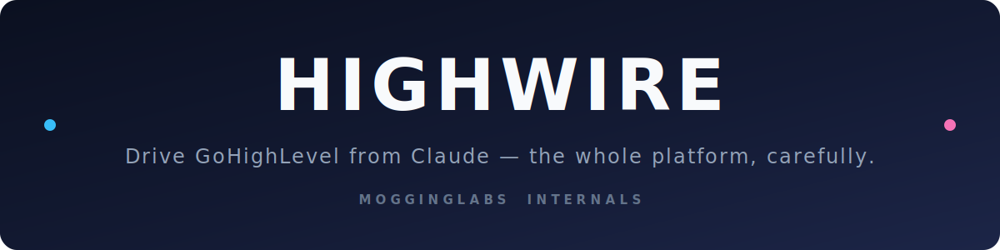

<div align="center">



<br/>

**The whole GoHighLevel platform — driven from Claude.**
Read, map, and build workflows, contacts, pipelines, calendars, and conversations
through a custom MCP server that speaks GoHighLevel's *internal* API — with human-paced
rate limiting so you stay under the radar.

<br/>

[](https://www.gohighlevel.com/)
[](https://modelcontextprotocol.io/)
[](https://www.python.org/)
[](https://nodejs.org/)
[](../LICENSE)

</div>

---

## 🎯 What we're building

GoHighLevel's **public** API exposes a limited set of tools and **cannot create or edit
workflows**. But every click inside the GHL web app fires an **internal API call**. Highwire
captures those internal endpoints and re-exposes them to Claude as a clean **MCP server** — so
Claude can do essentially *anything a human can do in the UI*, conversationally.

```
  You  ──▶  Claude  ──▶  Highwire MCP  ──▶  paced client  ──▶  GHL internal API  ──▶  Your CRM
                                              │
                                       human-timed, budgeted,
                                       backoff-aware, auditable
```

## ✨ What this accomplishes

| Capability | Public GHL API | **Highwire** |
| :--- | :---: | :---: |
| Read contacts, opportunities, pipelines | ✅ | ✅ |
| Read calendars & conversations | partial | ✅ |
| **Read every workflow, step-by-step** | ❌ | ✅ |
| **Create & edit workflows** (triggers, conditions, actions, emails) | ❌ | ✅ |
| Full-account extraction for dashboards | ❌ | ✅ |
| Drive it all conversationally from Claude | ❌ | ✅ |
| Built-in rate limiting to avoid suspension | n/a | ✅ |

The end state: **stop clicking through GHL**. Map your whole account, build sequences from a
sentence, and free your time for the work that actually grows the agency — sales, leads, clients.

## 🧱 How it works

Highwire is four layers stacked on the tightrope:

1. **Token grabber** — a tiny, auditable Chrome extension (or a manual DevTools capture) that
   reads GoHighLevel's **Firebase refresh token** from your logged-in session. You do this
   **once**; the client mints fresh short-lived ID tokens from it automatically.
2. **Internal-API client** (Python) — typed functions per object, replaying the exact requests
   the web app makes, with your real header/user-agent fingerprint.
3. **Pacing layer** — the safety net. Human-timed jitter, serial writes, per-hour/day budgets,
   exponential backoff, and a circuit breaker. This is a *first-class* part of Highwire, not an
   add-on. **Walk the wire slowly.**
4. **MCP server** — wraps the client so Claude (Claude Code, Desktop, or the API) gets one tool
   per action.

> 📐 Full design and the reverse-engineering method: **[docs/ARCHITECTURE.md](./docs/ARCHITECTURE.md)**

## 🚀 Quick start

> **Prerequisites:** a GoHighLevel account with access to at least one sub-account/location,
> [Python 3.11+](https://www.python.org/), [Node.js 18+](https://nodejs.org/), and
> [Claude Code](https://claude.com/claude-code) (or another MCP client). Google Chrome recommended.

```bash
# 1. Clone
git clone git@github.com:MoggingLabs/mogginglabs-internals.git
cd mogginglabs-internals/highwire

# 2. Configure your local secrets (never committed)
cp .env.example .env
#   → open .env and paste YOUR refresh token + location id

# 3. Install
python -m venv .venv && . .venv/bin/activate   # Windows: .venv\Scripts\activate
pip install -e .
npm install

# 4. Register the MCP with Claude
#   → see docs/USAGE.md for the exact one-line command
```

Then just talk to Claude:

> *"Use Highwire to pull the course sales sequence and map every step."*
> *"Build me an abandoned-cart workflow with a 3-email sequence and turn it on."*

Full walkthrough: **[docs/USAGE.md](./docs/USAGE.md)**

## 🔐 Security first — no keys, ever

- Your refresh token and location ID live **only** in a local, gitignored `.env`. This repo ships
  `.env.example` with **placeholders only**.
- Nothing about *our* accounts — or yours — is ever committed. See
  **[docs/SECURITY.md](./docs/SECURITY.md)** and the repo-level [SECURITY.md](../SECURITY.md).
- If a token ever leaks, **revoke it at the source** — deleting the commit is not enough.

## ⚖️ Responsible-use disclaimer

Highwire talks to GoHighLevel's **internal, undocumented** API. That is **very likely against
GoHighLevel's Terms of Service**, and using it carries a real risk of account suspension. Highwire
is built to automate **your own** accounts and includes rate limiting to behave like a normal human
user — **not** to abuse the platform, mass-target third parties, or evade abuse protections for
harmful ends.

**You are responsible for how you use it.** Test on a throwaway/sub-account first. This project is
provided under the MIT license with no warranty. Not affiliated with, endorsed by, or sponsored by
GoHighLevel/HighLevel or Anthropic.

## 🗺️ Roadmap

Highwire is built in phases — see [docs/ARCHITECTURE.md](./docs/ARCHITECTURE.md#build-phases).

- [ ] **P1** Auth: refresh-token capture + ID-token exchange
- [ ] **P2** Reverse-engineer read endpoints (all six object types)
- [ ] **P3** Paced read client + full extraction snapshot
- [ ] **P4** Reverse-engineer write endpoints (workflow creation first)
- [ ] **P5** Paced write client (dry-run + confirmations)
- [ ] **P6** MCP server
- [ ] **P7** End-to-end proof + dashboard export

## 🤝 Contributing

PRs welcome — see [CONTRIBUTING.md](../CONTRIBUTING.md). Keep the pacing layer intact and never
commit secrets.

## 📄 License

[MIT](../LICENSE) © MoggingLabs.

<div align="center"><sub>Part of <a href="../README.md">MoggingLabs Internals</a> · walk the wire carefully 🎪</sub></div>
